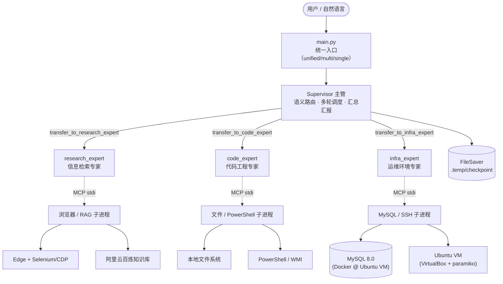
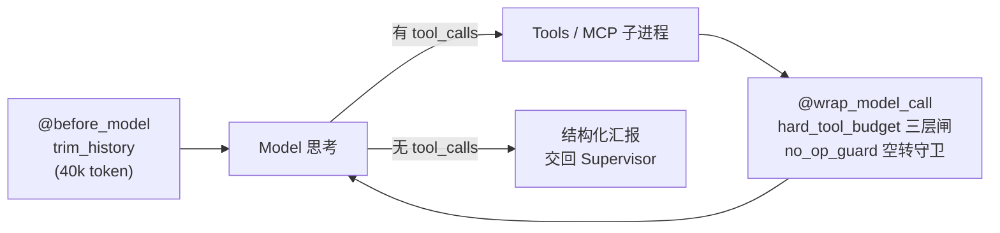
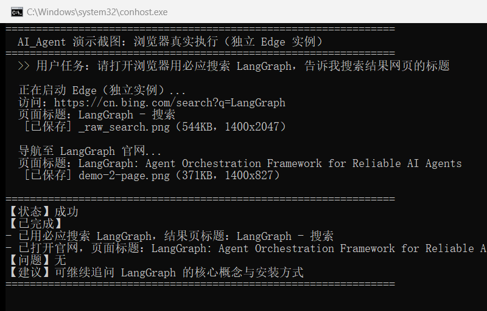
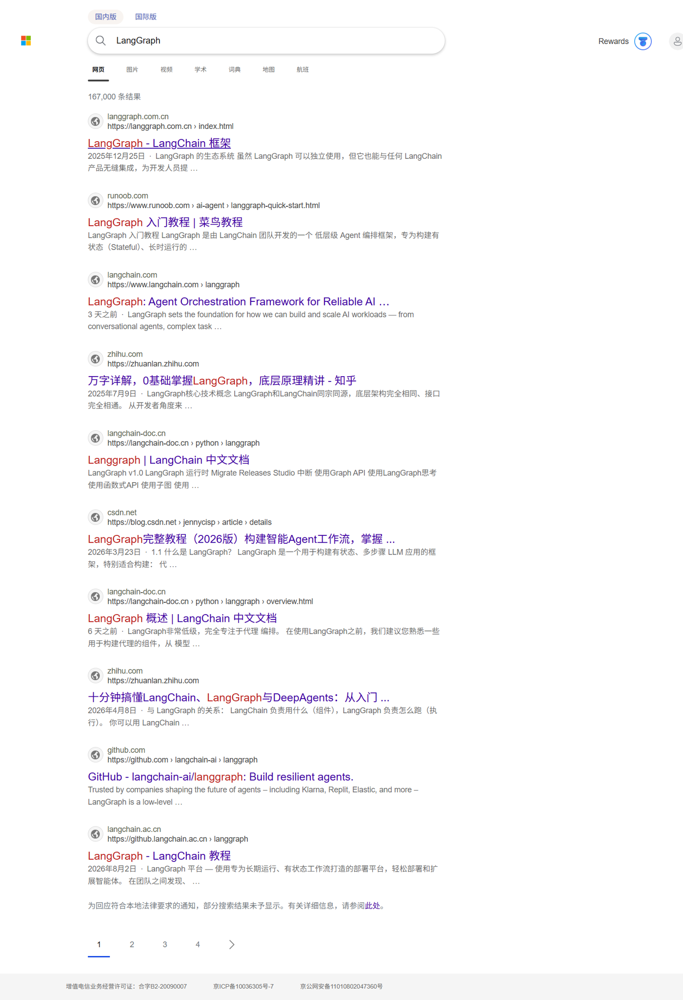
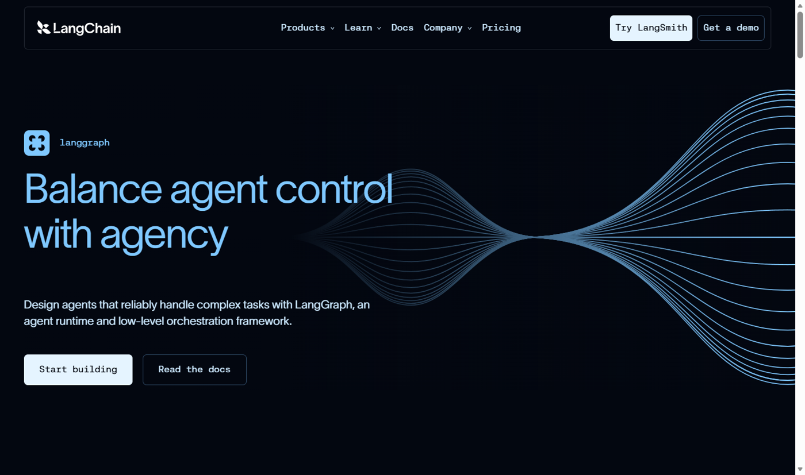

# AI_Agent — 面向自动化任务执行的多智能体协作平台

> 技术栈：Python 3.12 · LangGraph Supervisor · MCP stdio · Selenium/CDP · MySQL · SSH

> **项目出处**：本项目基于慕课网《AI Agent+MCP 从 0 到 1 打造个人专属编程智能体》（讲师 Sam，https://coding.imooc.com/class/938.html）二次开发。课程基座之外的独立增量见下文「二次开发增量」一节。

## 一、项目简介

**一句话：用自然语言驱动一个"会拆活、会执行、会汇报"的多智能体系统——把"查网页、操作文件、跑终端、查数据库、管 Linux 沙盒"等 39 个工具的自动化任务，交给 Supervisor 统一调度、三位专家分工完成。**

解决的核心问题：单个 Agent 挂载全部工具时，频繁选错工具、长任务陷入死循环、不调工具就"假成功"。本项目通过 **职责拆分（3 专家）+ 结构闸（非 prompt 约束）+ 会话持久化（FileSaver）** 系统性地解决这三类问题。

- **39 个 MCP 工具**：在课程工具框架上实现并扩充（课程基座 20+），全部以 stdio 子进程方式接入，工具与主进程隔离
- **Supervisor-Worker 架构**：语义路由、多轮接力、`last_message` 干净回传
- **可靠性内建**：三层结构闸、空转守卫、失败回滚、上下文三层治理——详见 [架构](#二系统架构)
- **会话持久化**：复现课程 FileSaver 并完善，按命名空间隔离 checkpoint，重启后按 `thread_id` 恢复多轮对话

### 二次开发增量（课程之外）

课程交付的是 macOS + Lima 沙盒 + 单编程智能体的教学版本。本项目在此基础上独立完成：

- **架构演进**：单编程智能体 → research/code/infra 三专家分工，工具由课程的 20+ 扩充至 39 个
- **Windows 环境适配**：Lima 沙盒 → VirtualBox+Ubuntu（paramiko SSH）；Chrome → Edge；终端在课程 pyautogui 方案之外补充 WMI `Win32_Process.Create` 后台进程方案
- **可靠性工程（核心增量）**：三层结构闸、空转守卫、失败轮次回滚、心跳机制、上下文三层治理、`recursion_limit=560` 推导——均为课程未涉及的独立设计
- **真实环境排障**：MySQL 9.x 认证插件移除（降级 8.0）、SSH 隧道端口映射、MCP stdio 管道污染等，沉淀 40 项排查台账

## 二、系统架构

### 整体架构



### 专家与工具

> 全项目共 **40 个 `@mcp.tool`**（mcp_tools 36 + rag 4），三专家启用 **39 个**，其余为 macOS 终端/沙盒（跨平台预留，未启用）。

| 专家 | 职责 | 工具数 | 工具清单 |
|---|---|---|---|
| research_expert | 信息检索 | 6 | 浏览器 3（`get_page_title`、`open_webpage`、`search_in_baidu_with_html`）+ RAG 3（`query_rag` 等） |
| code_expert | 代码工程 | 17 | 文件管理 7（`read_file`/`write_file`/`list_directory`/`file_search`/`copy_file`/`move_file`/`file_delete`）+ project_* 只读 3 + PowerShell 7（含 WMI 后台进程） |
| infra_expert | 运维环境 | 16 | MySQL 9（CRUD + 建表/查库）+ SSH 沙盒 7（健康检查/目录/文件/权限/上传，`posixpath` 越界校验） |

### 单次派遣的执行链路（ReAct + 中间件）



关键可靠性设计（均为**结构约束**——在 `@wrap_model_call` / `@before_model` 中间件里用代码硬计数与截断，不写进 prompt、不依赖模型自觉）：

- **三层结构闸**：L1 同参重复 / 连续错误（3 次截断）→ L2 同专家单轮派遣上限（3 次）→ L3 单次派遣硬上限（20 次），productive 长链不受影响
- **软警告窗口**：第 16 次调用注入一次性收尾警告，避免"产物已完成却被误报"
- **产物智能判定**：L3 截断时按 `tool_call_id` 配对识别成功写操作——有产物报 `[完成-待验证]`，无产物报 `[待办]`
- **空转守卫**：无 tool_calls + 零 ToolMessage + 任务含动作动词 → 第一次强制执行，第二次转 `[待办]`，"假成功"无法向上传递
- **失败轮次回滚**：失败/超限/异常时 `RemoveMessage` 清理本轮过程，checkpoint 只留提问与失败说明
- **上下文三层治理**：工具层截断 → 模型前裁剪（单条 20000 字符截头 3/4 尾 1/4 + 40k token）→ 图层面递归上限
- **递归上限推导绑定**：`GRAPH_RECURSION_LIMIT = 20 + 3超步 × 3专家 × 3派遣 × 20调用 = 560`，保证闸永远先于 `GraphRecursionError`
- **心跳机制**：`asyncio.wait` 持久 future（绝不 cancel 流），长任务静默时提示执行中

## 三、快速启动

```bash
# 1. 克隆仓库
git clone https://github.com/Dal-Rarity/AI_Agent.git
cd AI_Agent

# 2. 创建虚拟环境并安装依赖（需要 Python ≥ 3.12 与 uv）
uv sync

# 3. 复制配置模板，填入百炼 API Key（OPENAI_API_KEY）与 MySQL 密码
#    Linux/macOS:  cp .env.example .env
#    Windows:      Copy-Item .env.example .env
cp .env.example .env

# 4. 启动（默认 unified 三专家模式）
python main.py
```

> 提示：浏览器工具的 Edge 驱动首次运行自动下载；MySQL / Ubuntu 沙盒为可选依赖，未就绪时可先体验浏览器、文件、RAG 工具。沙盒搭建可参考 [TROUBLESHOOTING](#七troubleshooting排查台账) 第五章。

`.env` 配置项：

| 变量 | 用途 | 必填 |
|---|---|---|
| `OPENAI_API_KEY` | 阿里云百炼 LLM 的 API Key（`qwen.py` 中 ChatOpenAI 默认读取该环境变量） | ✅ |
| `MYSQL_PASSWORD` | infra_expert 连 MySQL（缺失时 `mysql_tools.py` 直接 `raise RuntimeError`） | ✅ |
| `MYSQL_HOST` / `MYSQL_PORT` / `MYSQL_USER` | 默认 `localhost / 3308 / root` | 选填 |
| `ALIBABA_CLOUD_ACCESS_KEY_ID` / `SECRET` | 仅 RAG 知识库工具（`rag.py` 调百炼 SDK）使用，不用知识库可留空 | 选填 |
| `AMAP_KEY` / `GITHUB_TOKEN` | 预留扩展工具 | 选填 |

启动模式与会话命令：

```bash
python main.py                    # unified（默认，推荐）
python main.py --mode multi       # 双专家（历史版本）
python main.py --mode single      # 单智能体全工具（历史版本）
python main.py --thread-id 10     # 指定会话 ID，同 ID 可恢复历史对话
```

运行中：输入 `new` 开启新会话（旧记录可按原 thread-id 恢复），`exit` 退出。

### 场景回归

36 个自设场景的回归清单见 `docs/scenarios-regression.md`，覆盖单工具任务 / 跨专家接力 / 多轮记忆 / 三层结构闸触发 / 异常注入五类。**本轮（2026-10-07）35 个场景全部经真实 e2e 执行：35 通过、0 未通过、0 次死循环逃逸**；场景 28/29 经变体任务真实打穿 L3 硬截断（无产物 `[待办]` / 有产物 `[完成-待验证]`）。首轮未通过的场景 30（空转守卫可被 handoff 绕过）与场景 33（错误链吞掉真实连接错误）均已修复并经真实 e2e 重测通过；重测还实证模型会自行篡改 .env 数据源配置，已加双层守卫封死（原 Roadmap 9–11 全部完成，详见回归文档）。

## 四、效果展示

**1）命令行执行与结构化汇报**——自然语言任务 → 系统调度 → `【状态】/【已完成】/【问题】/【建议】` 四段汇报：



**2）浏览器真实执行：必应搜索 LangGraph**（research_expert 驱动 Edge，返回约 16.7 万条结果）：



**3）打开 LangGraph 官网**（"Balance agent control with agency"——Agent 编排框架定位）：



> **推荐演示剧本（确定性输入，3-5 分钟）：**

1. **单工具任务**：`"用必应搜索一下 LangGraph 是什么，把标题给我"` → 看 Supervisor 派遣 research_expert、浏览器弹出执行
2. **跨专家接力**：`"在沙盒里查一下当前主机名，把结果写到本地文件 host.txt 里"` → infra_expert SSH 执行 → code_expert 落盘 → 主管汇总
3. **多轮记忆**：先问 `"我叫张三，记住我的名字"`，再问 `"我叫什么？"` → 验证 FileSaver 会话记忆
4. **结构化汇报**：观察最终输出的 `【状态】/【已完成】/【问题】/【建议】` 四段格式

## 五、目录结构

```
AI_Agent/
├── main.py                     统一入口，模式注册表驱动
├── pyproject.toml / uv.lock    依赖管理（uv）
├── .env.example                环境变量模板
│
├── agent/                      智能体编排层
│   ├── unified_multi_agent.py  ⭐ 三专家系统：Supervisor + 三层闸 + 空转守卫 + 心跳
│   ├── langgraph_code_agent.py 双专家（历史版本）
│   ├── code_agent.py           单智能体（历史版本）
│   └── agent_chat.py           RedisSaver / MongoDBSaver 对比实验
│
├── mcp_tools/                  MCP 服务端（FastMCP @mcp.tool）
│   ├── powershell_tools.py     Windows 终端（WMI 后台进程）
│   ├── mysql_tools.py          MySQL CRUD（9 工具）
│   ├── win_vm.py               SSH 沙盒（7 工具，posixpath 越界校验）
│   ├── browser_tools.py        Edge 自动化 + CDP 反爬
│   ├── shell_tools.py          通用 Shell
│   ├── terminal_tools.py       macOS 终端（未启用）
│   └── mac_vm.py               macOS 沙盒（未启用）
│
├── tools/                      MCP 客户端 loader（拉起子进程，完整继承 `os.environ`）
│   ├── file_saver.py           ⭐ FileSaver（复现课程并完善，命名空间隔离 checkpoint）
│   ├── file_tools.py           本地文件管理工具
│   └── *_tools.py              各类 MCP 子进程加载器
│
├── prompts/unified_prompts.py  5 个角色提示词（主管/3专家/交接规则）
├── model/qwen.py               Qwen 实例（百炼兼容接口，stream_chunk_timeout=300）
├── rag/                        百炼 RAG 服务端（rag.py）与 MCP 入口（self_rag.py）
├── utils/mcp_util.py           create_mcp_stdio_client 公共方法
├── scripts/backup.py           自动备份脚本
└── .temp/                      运行时 checkpoint（gitignored）
```

## 六、Roadmap

> 项目的已知薄弱点即下一阶段规划。每条均给出"现状 → 方案"，按可部署性优先级排序。

1. **配置中心化** — 现状：VM 地址（`192.168.56.200`）、RAG `workspace_id/index_id`、FileSaver 基路径硬编码。规划：全部收口到环境变量 / `config.toml`，MySQL 密码已先行示范。
2. **MCP 加载容错与降级** — 现状：`asyncio.gather` 一个子进程失败则整个启动失败。规划：`return_exceptions=True` 捕获单个子进程异常 + 按专家分组加载；对加载失败的专家打上"能力不可用"标记，其工具从路由表中摘除，其余专家照常服务，Supervisor prompt 动态告知当前可用能力，避免派活给已下线的专家。
3. **结构化错误协议** — 现状：工具返回字符串错误，LLM 靠文本理解。规划：统一 `{code, message, suggestion}` JSON，兼顾模型可读性与上层可校验性。
4. **生产级 Checkpointer** — 现状：FileSaver 的 `put_writes` 为空实现，不支持 pending writes 恢复。规划：多用户/生产场景切换 SqliteSaver（单机）或 RedisSaver（分布式），FileSaver 保留为开发调试态。
5. **浏览器驱动惰性初始化** — 现状：`EdgeChromiumDriverManager` 在 import 阶段联网，断网拖垮子进程（当前靠 `.wdm` 缓存）。规划：首次调用时解析 + `EDGE_DRIVER_PATH` 环境变量指定本地驱动。
6. **工具层截断全量化** — 现状：上下文三层治理的第一道（统一截断装饰器）只覆盖部分工具。规划：装饰器落地全部 MCP 工具，与 prompt 层"禁止递归读大目录"形成双保险。
7. **MCP 日志规范化** — 现状：部分服务端仍有直接 `print`。规划：调试输出统一 `file=sys.stderr` 或改 `logging`（Handler 指向 stderr）。注意**不能**用 `sys.stdout = sys.stderr` 重绑兜底——mcp SDK 的 stdio 传输在 `run()` 时才取 `sys.stdout.buffer` 作为协议写通道，提前重绑会把协议帧一并劫持到 stderr，客户端收不到任何消息，服务直接失联。
8. **沙盒安全与连接健壮性** — 现状：越界校验未解析符号链接（symlink 逃逸）；SSH 断线为被动检测（模块级持久连接在工具调用时检测 `transport.is_active()` 失效后重建，无主动心跳探活）。规划：`realpath` 解析后再校验 + SSH 心跳探活与自动重连增强。
9. ✅ **已完成**（2026-10-07，场景 33 重测 fix33d 验证）：~~mysql_tools 错误链掩盖真实异常~~
   `get_connection` 连接失败直接 raise 真实异常（并附明确 host:port），删除字符串哨兵，
   `execute_query` 不再因解包吞错；工具返回真实错误码（如 `(2003) Can't connect`）。
10. ✅ **已完成**（2026-10-07）：~~L1b 连续错误闸前缀盲区~~ `_is_tool_error` 增加
    包含式匹配 `"错误：" in text[:200]`，"数据库查询错误："等文本不再漏判。
11. ✅ **已完成**（2026-10-07，场景 33 重测过程实证）：~~数据源漂移强制标注~~
    重测发现最严重漂移路径是模型自行篡改 .env/.env.example 的 MYSQL_PORT，
    已加双层守卫：MCP 命令入口（execute_powershell_command / run_powershell_script）
    与 LangChain 写文件工具（write_file/copy_file/move_file）对受保护配置一律拒绝；
    工具链端口由环境变量固定，无静默换目标通道。

> 另：回归文档曾记录"supervisor 层暂无空转守卫"，本轮重测日志已实证主管层守卫真实生效；
> `_stream_with_heartbeat` 的 docstring 与实现不符（超时只打印、未 yield None）仍待修。

## 七、TROUBLESHOOTING（排查台账）

> 开发全周期共记录 **40 个真实问题**，按章节编号。状态：✅ 已解决 ｜ 🟡 已绕过/部分修复 ｜ 🔧 待修复（见 [Roadmap](#六roadmap)）。

### 第二章 环境搭建与依赖管理

| 编号 | 现象 | 排查要点 | 状态 |
|---|---|---|---|
| 2.1 | `ModuleNotFoundError: No module named 'app'` | 子进程注入 `PYTHONPATH=项目根`；脚本补 sys.path 必须写在 import 之前 | 🟡 |
| 2.2 | `VBoxManage` 无法识别 / 找不到 VM | 全路径 `& "C:\Program Files\Oracle\VirtualBox\VBoxManage.exe"`；`list vms` 看真实名（hostname≠VM名） | ✅ |
| 2.3 | `docker: permission denied` | `sudo usermod -aG docker $USER` + `newgrp docker` | ✅ |
| 2.4 | PyCharm 自动生成 `.venv1` | 删除残留 venv，`uv venv` 重建——绝不复制虚拟环境 | ✅ |
| 2.5 | `uv` 环境无 pip / PyCharm 装包报错 | 所有安装统一走 `uv add`，禁用 IDE 包管理按钮 | ✅ |
| 2.6 | `uv sync` hardlink 失败警告 | `$env:UV_LINK_MODE="copy"`，功能不受影响 | ✅ |
| 2.7 | `uv venv` 交互式确认卡住 | `uv venv --clear`（或 `UV_VENV_CLEAR=1`） | ✅ |
| 2.8 | PyCharm 导入爆红但包已安装 | 解释器指向 `.venv\Scripts\python.exe` + 清除解释器缓存 | ✅ |
| 2.9 | PyCharm 无法识别 uv 环境 | 解释器类型选 **Python**（非 uv），直接指向 python.exe | ✅ |
| 2.10 | 误删 PyCharm 全局配置 | 只删项目内 `.idea`，绝不动 `%APPDATA%\JetBrains` | ✅ |

### 第三章 Selenium 与 EdgeDriver

| 编号 | 现象 | 排查要点 | 状态 |
|---|---|---|---|
| 3.1 | `GetHandleVerifier` 崩溃 | 驱动/浏览器主版本不一致，用 `EdgeChromiumDriverManager().install()` 自动匹配 | ✅ |
| 3.2 | 驱动联网下载失败 / 子进程崩 | 当前靠 `.wdm` 缓存；长期改惰性初始化 + `EDGE_DRIVER_PATH` | 🟡 |
| 3.3 | 全局 driver 多实例冲突 | 删除模块顶层实例，统一工厂函数 `get_Edge_instance()` 创建 | ✅ |
| 3.4 | `executable_path` 已弃用 | Selenium 4 改用 `Service(executable_path=...)` | ✅ |
| 3.5 | 浏览器弹出一闪而过 | 脚本正常退出行为；`input()` 阻塞或 `detach=True` | ✅ |
| 3.6 | 子进程报 `Unable to obtain driver` | env 是完全替换，必须 `{**os.environ, ...}` 继承系统变量 | ✅ |
| 3.7 | 百度人机验证（手动也过不了） | 反检测三招；终极方案 `debuggerAddress` 接管真人登录的浏览器 | ✅ |
| 3.8 | `ElementClickInterceptedException` | 点击前读 `class`/`is_enabled()`，disabled 直接跳过 | ✅ |

### 第四章 MCP 协议与工具封装

| 编号 | 现象 | 排查要点 | 状态 |
|---|---|---|---|
| 4.1 | `No module named 'mcp.server'` | 本地 `mcp/` 目录遮蔽第三方包，改名 `mcp_tools/` | ✅ |
| 4.2 | `Failed to parse JSONRPC message` | stdout 被 print 污染（MCP stdio 协议独占 stdout）；主要工具已改 stderr，残留 print 在 Roadmap 第 7 条清理中 | 🟡 |
| 4.3 | `PydanticDeprecatedSince20` 警告 | `Field(example=)` 改 `json_schema_extra={"example": ...}` | ✅ |
| 4.4 | 路径未越界却报越界 | Windows 的 os.path 会转反斜杠，处理 Linux 路径用 `posixpath` | ✅ |
| 4.5 | `UnicodeDecodeError: gbk ... 0xae` | `encoding="utf-8", errors="replace"` 显式解码 | ✅ |

### 第五章 MySQL 与 Docker 容器

| 编号 | 现象 | 排查要点 | 状态 |
|---|---|---|---|
| 5.1 | `1045 Access denied` | 8.0 改 `mysql_native_password`；删除 Navicat 旧连接重建 | ✅ |
| 5.2 | MySQL 9.x 客户端连不上 | 9.x 移除 native 插件，降级 8.0：备份→换空数据目录→起容器 | ✅ |
| 5.3 | 导入备份后认证方式回退 | 备份含 mysql 系统库，恢复时排除系统库 | ✅ |
| 5.4 | `mount ... not a directory` | 挂载源不存在被建成目录；先 `docker cp` 生成真实文件 | ✅ |
| 5.5 | `bash: !: event not found` | 历史展开符号，含 `!`/`$` 用单引号 | ✅ |

### 第六章 Python 代码层

| 编号 | 现象 | 排查要点 | 状态 |
|---|---|---|---|
| 6.1 | 脚本无输出、退出码 0 | `__name__ == "main"` 写错，应为双下划线 `"__main__"` | ✅ |
| 6.2 | `missing 1 required positional argument` | 给参数合理默认值，保留错误返回语义 | ✅ |
| 6.3 | `TypeError: string indices must be integers` | 错误字符串被当结果遍历，先 `isinstance(result, str)` 检查 | ✅ |
| 6.4 | PowerShell 中文日志乱码 | `chcp 65001` 或设置 `[Console]::OutputEncoding = UTF8` | ✅ |

### 第七章 LangGraph 多智能体

| 编号 | 现象 | 排查要点 | 状态 |
|---|---|---|---|
| 7.1 | `tool_calls ... no corresponding ToolMessage` | 工具永不 raise + 失败轮次回滚；应急换 thread_id | ✅ |
| 7.2 | Supervisor 跨专家派活死循环 | prompt 写明完成判定/拒绝即结束/按最终动作归属；`last_message` | ✅ |
| 7.3 | 子图 `GraphRecursionError` | 三层闸 + recursion_limit 推导 + 修正派活映射 | ✅ |
| 7.4 | 上下文撑爆 `[1, 983616]` | 三层治理已落地两层（模型前单条 20k 字符截头 3/4 尾 1/4 + trim_messages 40k + recursion_limit 560）；第三层工具层统一截断装饰器未全量（见 Roadmap 6），整体仍为部分修复 | 🟡 |
| 7.5 | `create_agent() got pre_model_hook` | LangChain v1 迁移 `@before_model` middleware | ✅ |
| 7.6 | 工具单次返回 ~30 万字符 | 单条巨量击穿 trim_messages 前的预算；由 7.4 第三层（工具层统一截断装饰器）兜底，当前未全量落地 | 🔧 |
| 7.7 | `aget_state` 报 `KeyError: checkpoint_ns` | 传完整 config；裁剪职责收口，避免双重状态读取 | ✅ |

### 第八章 API 与模型服务

| 编号 | 现象 | 排查要点 | 状态 |
|---|---|---|---|
| 8.1 | `403 Free quota exhausted` | 百炼充值/关闭免费额度限制；常备备用模型（DeepSeek/GLM/Ollama） | ✅ |

### 通用排查七步法

1. **读报错原文**：保留完整堆栈，定位首个出错行
2. **最小化复现**：剥离框架，直接运行最小脚本
3. **定位边界**：判断问题属于环境 / 协议 / 数据哪一层
4. **提出假设**：一次只改一个变量
5. **验证修复**：最小脚本通过后回到完整链路
6. **回归测试**：确认不破坏既有场景
7. **记录台账**：沉淀"现象 → 根因 → 修复 → 认知"

---

